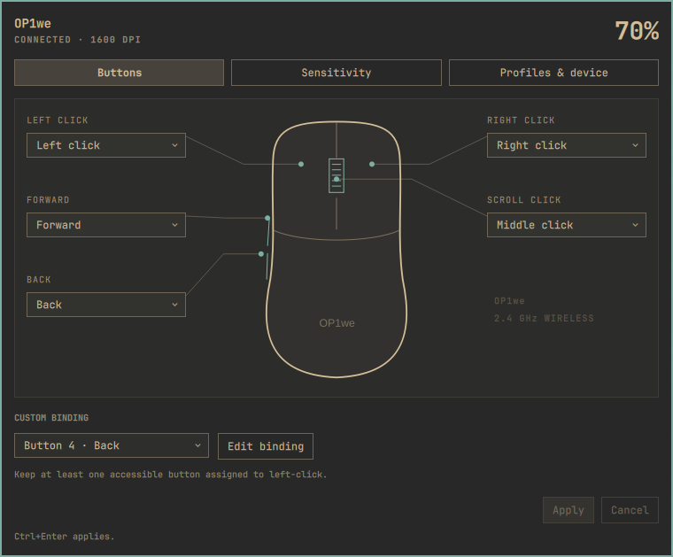
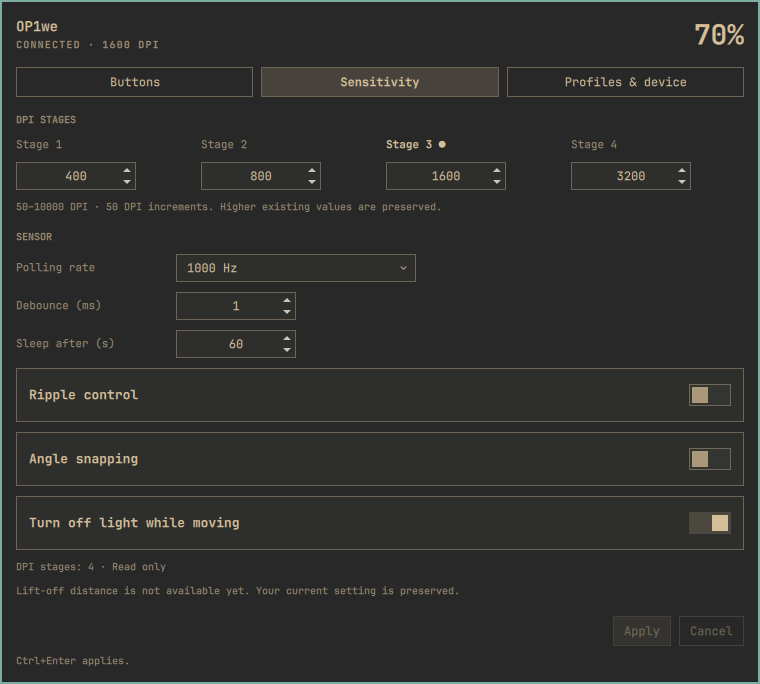
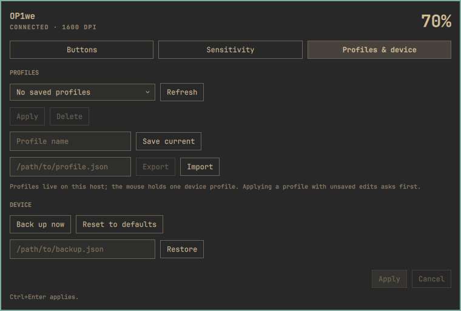

# OP1we Control

A native Omarchy panel for the Endgame Gear OP1we: battery in your bar,
button mappings around a mouse outline, and compact DPI, sensor and profile
controls. Uses your current Omarchy colors, fonts and borders.



Native Quickshell capture with fixture values for layout demonstration;
it is not evidence of a live configuration write.

<details>
<summary>Sensitivity and profiles</summary>




</details>

**0.4.0 is a development preview.** Supported controls are listed below.
Full driver parity is still blocked by the hardware/protocol work recorded
in [the parity matrix](docs/parity.md). No macros or other mouse models.

## Install on Omarchy

Requires Omarchy 4.0.2-compatible Quickshell and Python 3. No pip packages,
Node, build tools or background service are needed at runtime.

Install directly from GitHub:

```bash
omarchy plugin add https://github.com/itchyfeetleech/omarchy-op1we --enable
```

For the permission commands below, first enter the installed directory:

```bash
cd ~/.config/omarchy/plugins/hoppcx.op1we
```

Alternatively, from a checkout or the extracted release archive:

```bash
bash scripts/install-dev.sh
omarchy-shell shell rescanPlugins
omarchy plugin enable hoppcx.op1we --section right
omarchy-shell shell toggle hoppcx.op1we
```

Installation copies files to `~/.config/omarchy/plugins/hoppcx.op1we`.
It validates the staged plugin and refuses unmanaged installations, local
modifications and symlinks. Rerunning the installer updates an unchanged
managed copy. It does not change your permissions or mouse settings.
If the shell retains old QML after an update, run `omarchy restart shell`.

### Receiver permissions

If the panel reports permission denied, install the narrow receiver rule
once as an explicit administrator action:

```bash
sudo install -m 0644 udev/70-op1we-control.rules /etc/udev/rules.d/70-op1we-control.rules
sudo udevadm control --reload-rules
```

Physically replug the receiver, move the mouse, then select Retry. The rule
uses active-session `uaccess` for `3367:1961`; it does not grant all-HID or
world-write access. The helper runs as your normal user. The verified
transport is the wireless receiver; wired operation remains unverified.

Before enabling writes, use **Enroll this receiver** and confirm that its
paired mouse is the OP1we. Enrollment checks descriptor and port continuity. Before every settings write,
the helper also queries the paired model and requires the verified OP1we
identifiers (CID `35`, MID `02`). Unknown or unavailable model replies block writes.

## Use

- Click the bar mouse icon to open the panel. Hover shows the mouse name,
  battery status and current DPI; right-click toggles the percentage,
  middle-click refreshes.
- **Buttons:** choose assignments beside the mouse outline. Choose Custom
  binding for key/combo/media actions; use the binding picker for other slots.
- **Sensitivity:** four DPI stages, polling, debounce, sleep, ripple,
  angle snapping and light behavior.
- **Profiles & device:** save/import/export host profiles and back up,
  restore or reset supported settings.
- Edits remain a draft until **Apply** (Ctrl+Enter). Cancel discards the draft.
  Closing with edits offers Keep/Discard. Tab/Enter navigate controls; Escape
  closes dropdowns/dialogs before the panel.

Supported DPI is 50–10000 in steps of 50; polling 125/250/500/1000 Hz;
debounce 0–30 ms. Above-10000 DPI, LOD, stage-count changes and some special
button actions remain unavailable. Unsupported values are preserved.
The outline follows vendor default mappings; only Back has independent
physical mapping evidence. See [device evidence](docs/device.md).

If the mouse sleeps, move it and Retry. Cached battery values are labelled.
A stale draft is re-read for review. A failed write is not retried blindly;
use its recovery information before attempting further edits.

Profiles and the latest ten recovery backups live in
`$XDG_STATE_HOME/op1we-control` (default `~/.local/state/op1we-control`), with
private directory/file permissions. Profiles are the plugin's JSON format,
not vendor `.dct` files. Settings are never automatically replayed on reconnect.

To diagnose the receiver without touching mouse settings, run from this
directory (installed copy: `~/.config/omarchy/plugins/hoppcx.op1we`):

```bash
PYTHONPATH=backend python3 -m op1we probe
PYTHONPATH=backend python3 -m op1we status
PYTHONPATH=backend python3 -m op1we read
```

Each prints one JSON document; a `permission` error means the udev rule
above is missing. Exit codes: 0 success, 2 invalid input, 3
unavailable/permission/unsupported, 4 busy/conflict, 5 protocol failure.

## Remove

For a GitHub/marketplace installation:

```bash
omarchy plugin remove hoppcx.op1we
```

For a managed development/archive installation:

```bash
omarchy plugin disable hoppcx.op1we
bash scripts/uninstall-dev.sh
omarchy-shell shell rescanPlugins
```

Only recorded, unchanged development-install files are removed. Local
modifications cause refusal so you can preserve them first. Unrelated files,
profiles, backups and other shell settings remain. The optional system udev
rule remains; remove that exact rule separately if you no longer want access.

## Check and package

On the target Omarchy system (development additionally needs Node and Qt's
`qmllint`):

```bash
bash scripts/check.sh
bash scripts/package.sh
(cd dist && sha256sum -c op1we-control-0.4.0.tar.gz.sha256)
```

The archive contains only allowlisted runtime files, installation scripts,
documentation and license. Extract to a new directory and run its installer;
never extract it over an existing plugin. No private captures, tests, caches
or Git history are packaged. `--portable` skips native dependency/manifest
validation for CI only; a portable pass is not native acceptance.

GitHub Actions runs Python/Node tests, compilation, shell checks, portable
packaging and checksum verification. Native lint, shell load and physical
acceptance run on Omarchy. See [release verification](docs/release.md) and
[hardware results](docs/hardware-results.md).

## License

MIT. Original outline and bar glyph; no proprietary artwork or vendor
binaries are redistributed. The WE-series framing research reference and
its attribution are recorded in [LICENSE](LICENSE) and [protocol notes](docs/protocol.md).
